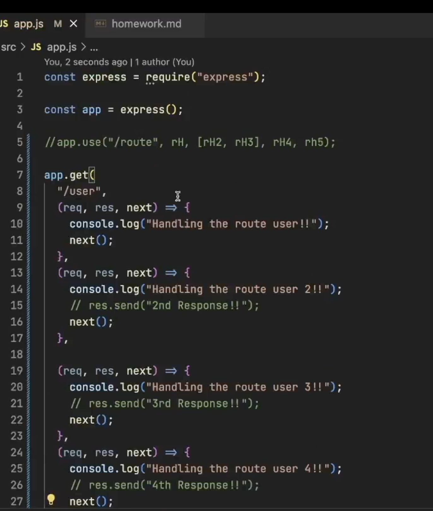
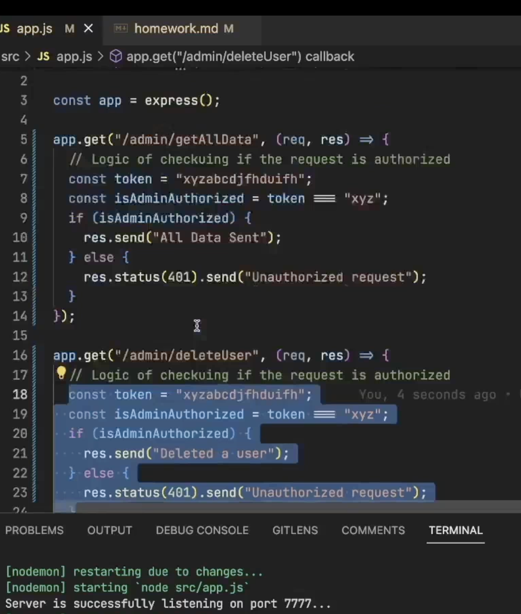
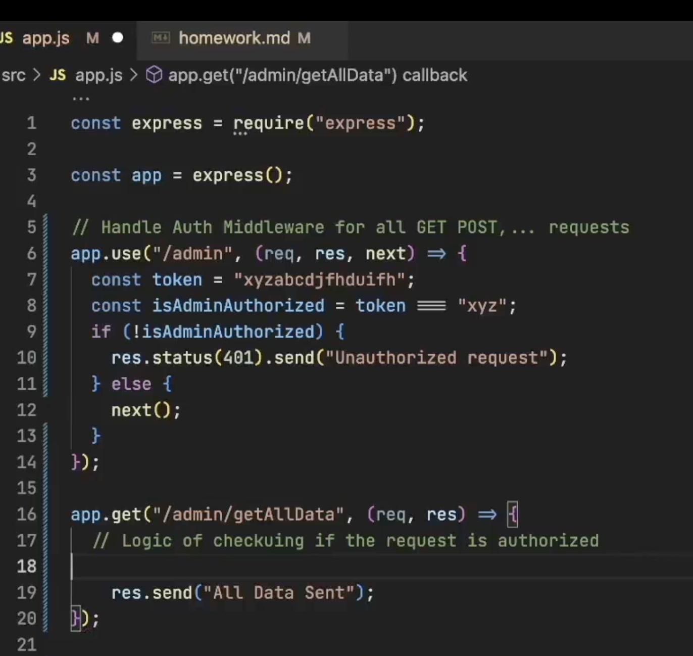
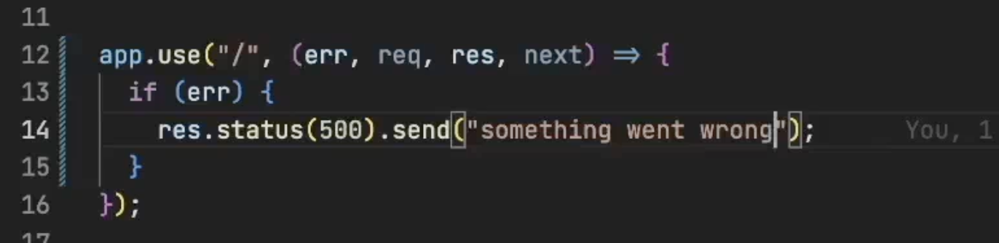

- First we do npm init, and then package.json which is the configuration comes up.
- And then we do npm i express -> when we do this, node_modules and package-lock.json comes up, inside node_modules we have tons of modules, also includes express folder, so when we do npm i express -> it installs express dependecy and , all dependcies on which this express is dependent. , and adds express as a dependency in package.json. 
- what is bin folder in node_modules ? 
- what is package-lock.json ? this tells us the exact version that we are running on. 
- version naming convention  - 4.19.2 meaning , major release is 4, minor release is 19 and patch is 2.
- express": "^5.1.0 , meaning ? we can also write it as ~5..1.0., tilda or carrot helps us auto update if that dependency version was updated.
- if we dont put that carrot and all then it wont auto-update.
- installing npm i -g nodemon, installs nodemon which doesnt require us to run the server again and again after the changes are done. 
- we can add these as a script in package.json.
- in routing, if i do app.get("/ab?c") -> this means b is optional, so if i do /abc on browser it works and /ac also works. 
- order of routes matter, and app.use() output would be outputted for both get and post if same routes are usedin both. 
- /ab+c -> then abbbbbbbc, any number of b u can use. 
- /ab*cd means -> /abfheifewufhewfbcd , anyt characters between ab and cd. 
- /a(bc)?d -> /ad also should work as it means, bc is optional. 
- we can put regex inside these routes as well. 
- to read the query parameters - /user?userId=101&.., u do req.query 
- user/777 or user/107,dynamic query parameters , we do app.get("/user/:userId), we use -> req.params. 
- if u dont send any response in the request handler, then the request will hang. 
- next() allows to go to the next request hadnler for the same route, its the 3rd parameter like (req, res, next)
Example of multiple route handlers. 

- These route handlers are called as middlewares. , basically the functions that finally sends a response is the request handler, and all other request handlers in that route are the middlewares. 
- route -> middleware chain -> request handler. 
- so only job of express is take the request and send the response as soon as posssible.
- Cant keep putting same code like this again and again say for all admin based routes, authorization tasks, hence midleware is present.
- 
- so to mitigate this issue on top, we do this 

- as we know that when we use the app.use("/admit"), then it hits it first doesnt caer about whatever comes after admin and then goes next. 
- we can also write it like the image below. Say we dont need that middleware for login right. but the data after with/wihtout logging in has to be protected.

- To handle errrors gracefully by using try and catch blocks or by using middlewares like below.

